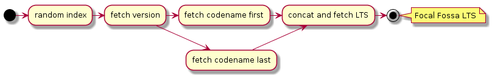

## Demo 1: Bank demo

This demo shows how easy to work with Kotlin when we need to process data (compared to Java).   

OTP is the largest bank in Hungary. In the `otp.csv` file we have a set of data with OTP bank offices in Budapest.  

The demo application tries to simulate an application written using Hexagonal architecture, where the domain model and 
the service containing the business logic sits in the middle of the architecture, and should not use any non-domain related 
classes. Any transport layer and object should be converted to domain object before and after calling the service.  

The application loads the data from the csv file without using any external library. After this we would like to query 
all the OTP banks of Budapest based on:
- weekend opening hours
- available free WiFi

The service will group the banks by availability, which can be:
- Reduced: opened less than 5 days a week
- Normal: opened from Monday to Friday
- Increased: opened on Saturday
- AllDay: opened every day of the week

Based on this grouping the query object will do the second step filterings.

Statistics:  
Java: 510 LOC / 1236 words  
Kotlin: 175 LOC / 450 words  

```bash
find java/hu/telekom/bankdemo -type f -name "*.java" -print | xargs wc -lw
...
  510  1236 total

find kotlin/BankDemo -type f -name "*" -print | xargs wc -lw
...
 175  450 total
```

<br/>

## Demo 2: Random Ubuntu release

This demo will have a mocked HTTP service on http://localhost:8080, what will provide different informations about the 
Ubuntu releases. 

| url                       | path variable               | reponse                              | sample request                            | sample response       |
|---------------------------|-----------------------------|--------------------------------------|-------------------------------------------|-----------------------|
| /version/{idx}            | index in ubuntu-release.txt | release version                      | /version/31                               | 20.04                 |
| /codename/first/{version} | release version             | codename firt part                   | /codename/first/20.04                     | Focal                 |
| /codename/last/{version}  | release version             | codename last part                   | /codename/last/20.04                      | Fossa                 |
| /lts/{codename}           | release codename            | LTS if release has long term support | /lts/Focal%20Fossa<br/>/lts/Eoan%20Ermine | LTS<br/>404 NOT_FOUND |

Every endpoint has a random delay of 1 second with max +/- 0.5 seconds of deviation. 

Our Demo service will have an endpoint http://localhost:9000/random-releases?qty=5 what will return a list with the given 
number of random Ubuntu release names, i.e.
```
Focal Fossa LTS
Raring Ringtail
Lucid Lynx LTS
Yakkety Yak
Feisty Fawn
```

The service will generate random indexes and will call the mocked endpoints in this order:




Statistics:  
Java: 146 LOC / 325 words  
Kotlin: 149 LOC / 361 words  

```bash
find java/hu/telekom/ubuntureleasedemo -type f -name "*.java" -print | xargs wc -lw 
...
 146  325 total

find kotlin/UbuntuReleaseDemo -type f -name "*" -print | xargs wc -lw 
...
 149  361 total
```